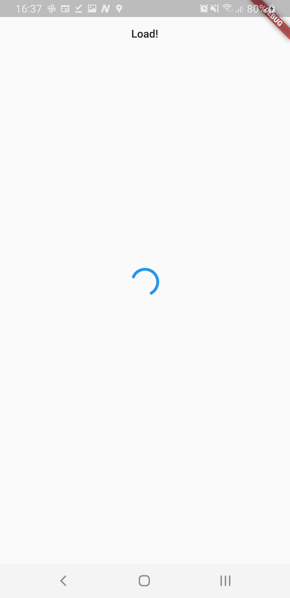
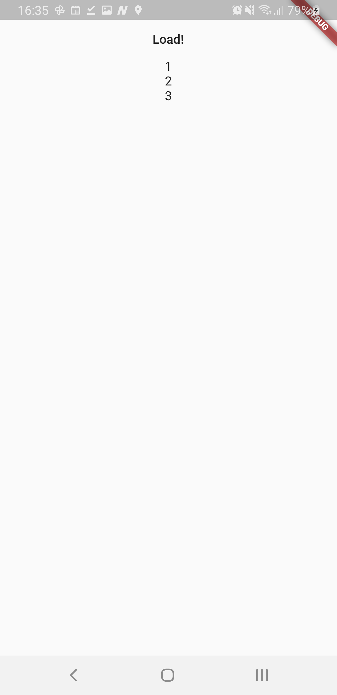

# flutter_mvvm_sample

| loading | loaded |
|:--|:--|
| `isLoading=true, data=[]` | `isLoading=false, data=[1,2,3]` |
|||

```dart
class HomePageState {
  const HomePageState({this.isLoading = false, this.data = const []});

  final bool isLoading;
  final List<int> data;
}

class HomePageController extends StateNotifier<HomePageState> {
  HomePageController() : super(const HomePageState());

  load() async {
    state = HomePageState(isLoading: true, data: state.data);

    await Future.delayed(Duration(seconds: 3));

    state = HomePageState(isLoading: false, data: [1, 2, 3] + state.data);
  }
}
```

